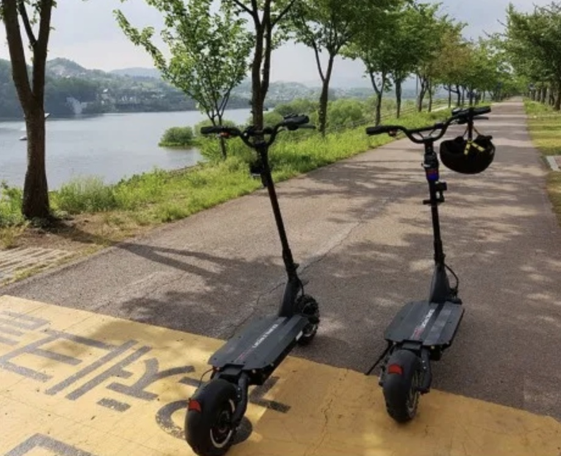
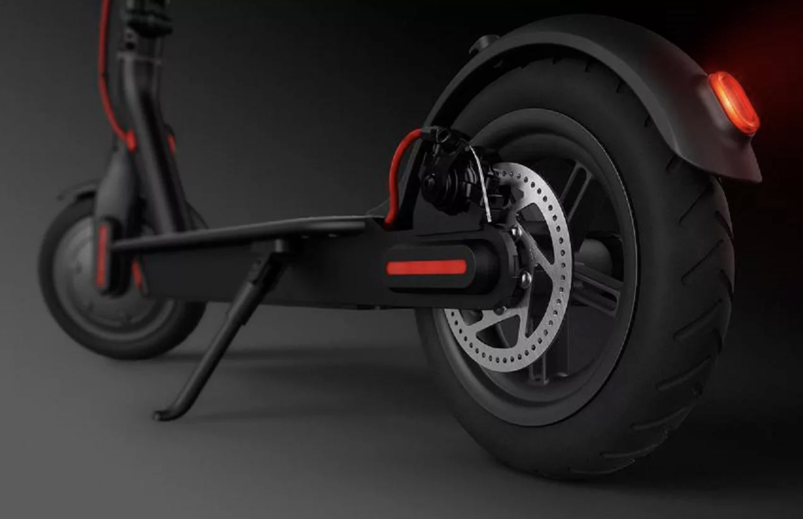

## Доп правила

*Возможно вы планируете передвигаться с ребенком - возьмите с собой бампер на руль*

*Возможно вы планируете оставить самокат на улице - возьмите с собой в рюкзак противоугонное устройство*

## Фотографии устройств для наглядности

**Проверка температуры на улице

1. Проверьте прогноз погоды
2. Комфортная температура для передвижения должна быть в пределах -35C<t<35C
